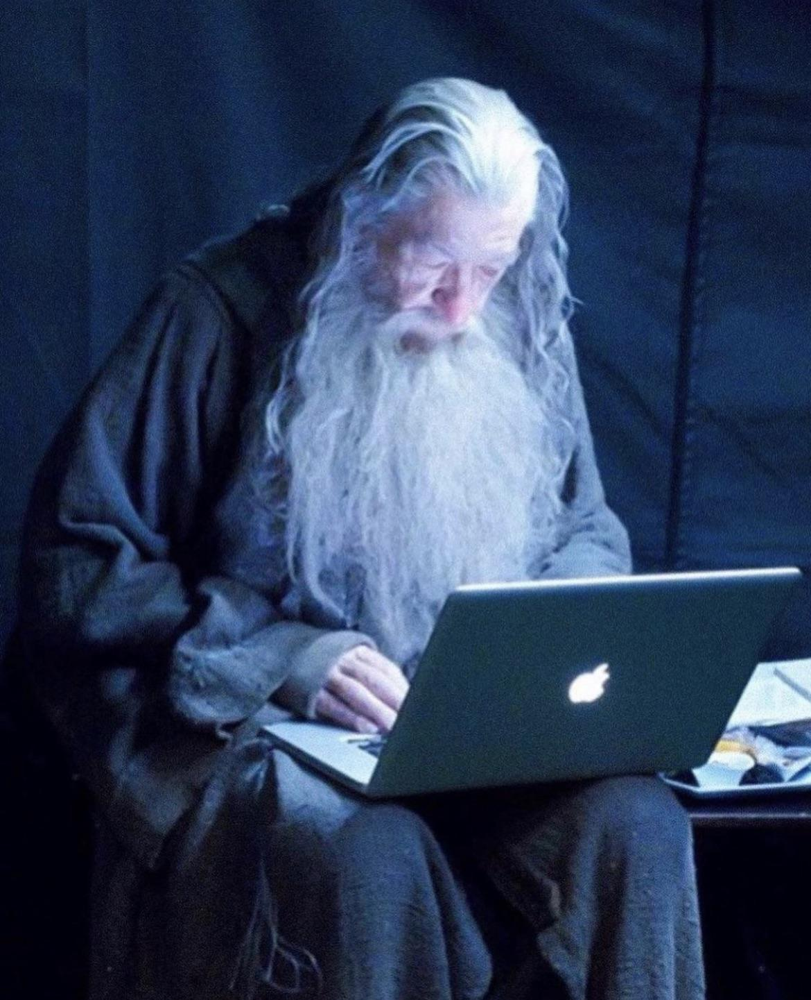
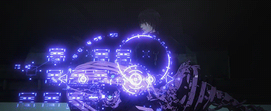

# obsidian-vault-template

![[gandalf.jpg|250]]

Isto aqui é só um template muito básico, customize da maneira que preferir.

E com o tempo, pode se tornar algo parecido como isto aqui.

![[Peek 2023-12-16 23-33.gif]]

Os nodos principais são [[Computer Science]] e [[Software Engineering]].

Adicione gifs para da mais graça a escrita e leitura: **_nerd mode: on_**

![[cibo2.gif]]
